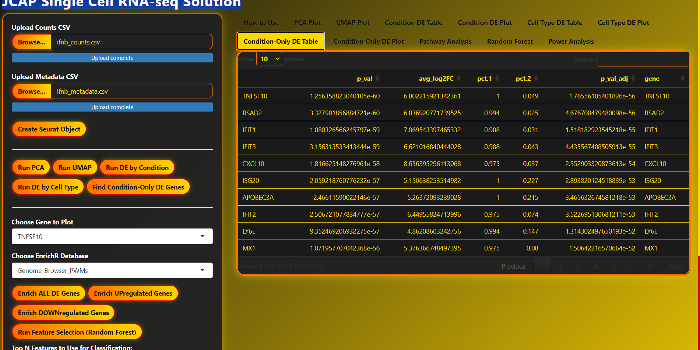

# JCAP Single Cell RNA-seq Solution


A fully interactive, reproducible pipeline for single-cell RNA-seq analysis and visualization, built in R/Shiny and ready for both desktop and high-performance computing environments.

---

## 📸 Screenshots

| PCA Plot                        | UMAP Plot                        |
|----------------------------------|----------------------------------|
|  |  |

| Condition-Only DE Table                            | Pathway Analysis Barplot                           |
|----------------------------------------------------|----------------------------------------------------|
|  |  |

| Volcano Plot                                  | Heatmap                                  |
|-----------------------------------------------|-------------------------------------------|
|  |        |

*Explore more features and screenshots in the `screenshots/` folder!*


## **Key Features**

- **Easy interactive analysis:** Upload your data, run PCA, UMAP, DE, pathway enrichment, classification, power analysis—all in one place
- **No coding required for users**
- **Publication-ready outputs:** Interactive Plotly plots and downloadable tables
- **Robust containerization:** Run anywhere with Singularity/Apptainer
- **Batch-friendly:** Easily deploy on HPC via SLURM

---

## **Tech Stack**

- **Languages:** R (4.3.x)
- **Framework:** Shiny
- **Major R packages:**  
  - `Seurat` (from GitHub, latest)
  - `plotly` (interactive plots)
  - `ggplot2`, `dplyr`, `DT`
  - `enrichR` (pathway enrichment)
  - `randomForest`, `caret`, `pwr`
- **Container:** Singularity / Apptainer (`rocker/shiny:4.3.1` or `rocker/r-ver:4.3.1`)
- **HPC integration:** SLURM-compatible batch scripts

---

## **How To Use**

### **1. Local (RStudio/Desktop) Usage**

**Requirements:**  
- R 4.3 or higher
- Install R packages as listed above (see [`singularity.def`](singularity.def) for full list)

**Steps:**
1. Clone the repo:
   ```bash
   git clone https://github.com/yourname/JCAP_Single_Cell_RNA-Seq-Solution.git
   cd JCAP_Single_Cell_RNA-Seq-Solution
Open app.R in RStudio.

Click "Run App".

Follow the on-screen instructions (see Readme.txt).

2. HPC Usage (SLURM + Singularity)
Requirements:

Singularity/Apptainer installed on your cluster

SLURM for job scheduling

Steps:

Build the container (once):
in bash
singularity build sc_shiny.sif singularity.def

Copy your input files and app.R into your work directory.

Edit the provided run_shiny.sbatch if needed.

Submit to SLURM:
using the following command 
sbatch run_shiny.sbatch
Find your job’s node:
squeue -u $USER
Tunnel to the running node and view in your browser:
use the following command in bash
ssh -N -L 3838:localhost:3838 your_username@NODE_NAME

Open http://localhost:3838 in your browser.

Data Requirements
Counts matrix:

CSV format

Genes/features as rows, cells/samples as columns

First column = gene names, first row = sample names

Metadata:

CSV format

Rows = cell/sample names (matching counts)

Columns = sample annotations (group, batch, celltype, etc.)

First column = sample names

#Repo structure

JCAP_SINGLE_CELL_RNA-Seq-Solution/
│
├── QC_tool/
│   └── Insurance_policy_script.R    # Standalone QC and data cleaning script
│
├── Seurat_APP/
│   ├── Insurance_policy_script.R    # Copy for user convenience
│   ├── Readme.txt                   # How-to instructions shown in-app
│   ├── app.R                        # The main Shiny app
│   ├── run_shiny.sbatch             # Example SLURM batch script for app launch on HPC
│   ├── singularity.def              # Singularity/Apptainer definition file
│   └── www/
│       └── flame_theme.css          # Custom app theme
│
├── screenshots/                     # Example screenshots for documentation
│
├── README.md                        # (This file)
└── download_subset_infb.R           # Utility script for fetching example data


Run QC/preprocessing with the included insure_policy.R script


